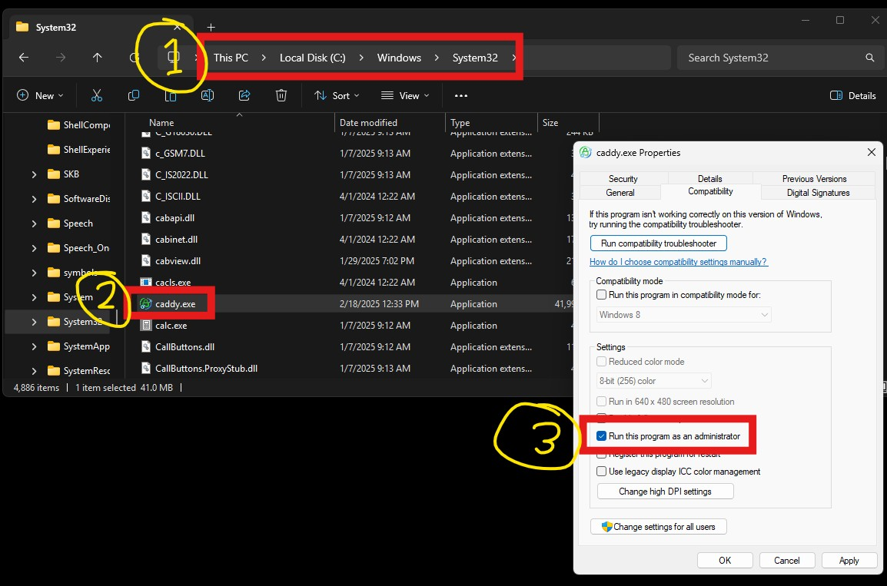
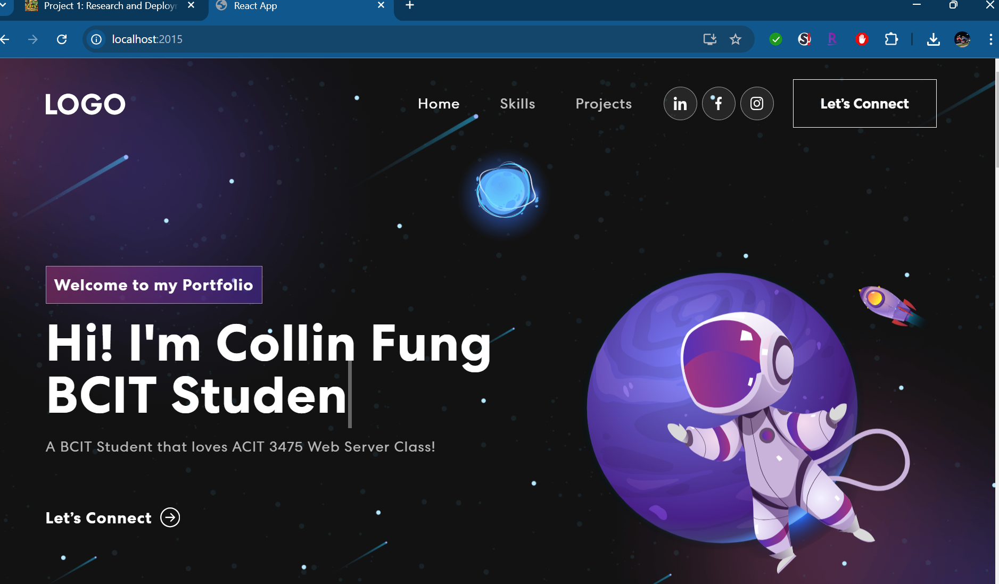

# ACIT 3475 - Caddy vs Apache vs Nginx

---

## Part 1: Caddy vs Apache vs Nginx

---

### *Introduction*
When choosing a web server, the three most popular options are Caddy, Apache, and Nginx. Each has its own strengths and weaknesses, making them suitable for different use cases, from simple static sites to high-performance applications. This comparison highlights the key differences in performance, ease of use, security, and configuration to help you decide which server best fits your needs.


### Caddy vs Apache vs Nginx Comparison

| Feature               | **Caddy** 🟢 | **Apache** 🔵 | **Nginx** 🔴 |
|----------------------|-------------|--------------|-------------|
| **Ease of Setup**    | ✅ Very easy, minimal config (automatic HTTPS) | ❌ Complex, requires manual setup | ⚠️ Moderate, config can be tricky |
| **Performance**      | ⚡ Fast, but slightly behind Nginx in high-load cases | 🐌 Slower under high traffic due to process-based architecture | 🚀 Extremely fast and efficient |
| **Memory Usage**     | 🟢 Low (but slightly higher than Nginx) | 🔴 High (uses process-based model) | 🟢 Very Low (event-driven) |
| **Reverse Proxy**    | ✅ Built-in, simple config | ✅ Supported, but requires `mod_proxy` | ✅ Built-in, widely used for this |
| **Static File Serving** | ✅ Built-in and optimized | ✅ Supported, but less efficient than Nginx | ✅ Extremely optimized for static files |
| **Load Balancing**   | ✅ Built-in | ✅ Supported, but needs additional modules | ✅ Built-in, highly efficient |
| **HTTPS (SSL/TLS)**  | 🔥 Auto HTTPS (Let’s Encrypt built-in) | ❌ Manual setup (needs Certbot/OpenSSL) | ❌ Manual setup (Certbot/OpenSSL required) |
| **Configuration**    | ✅ Simple (`Caddyfile`, human-friendly) | ❌ Complicated (`.conf` files, many directives) | ⚠️ Moderate (`.conf` files, structured but can be tricky) |
| **Modules & Extensibility** | ⚠️ Somewhat limited, but supports plugins | ✅ Very modular (`mod_rewrite`, `mod_proxy`, etc.) | ⚠️ Limited but efficient |
| **Security Defaults** | 🔥 Secure by default, automatic HTTPS & modern TLS settings | ❌ Requires manual hardening (defaults are weak) | ⚠️ Good defaults but still needs tuning |
| **Best Use Case**    | 🚀 Easy setup for small-to-medium projects, modern apps (React, Vue, APIs) | 🏗️ Traditional apps (PHP, legacy projects) | 🌍 High-performance web servers, reverse proxy, microservices |

## Summary
- **Caddy**: Best for developers who want an easy, modern web server with automatic HTTPS.
- **Apache**: Best for traditional websites, PHP applications, and older deployments.
- **Nginx**: Best for high-performance web servers, reverse proxies, and load balancing.

🚀 **For your React deployment with Caddy, it's a great choice due to its simplicity and built-in HTTPS support!**

**References:**
- [Caddy Documentation](https://caddyserver.com/docs/)
- [Apache HTTP Server](https://httpd.apache.org/)
- [Nginx Documentation](https://nginx.org/en/docs/)

---

## **Part 2: Local Deployment and Portfolio Setup**

### **Step 1: Installing Caddy on Windows**

1. **Download Caddy**: [Caddy Download](https://caddyserver.com/download)
2. **Move `caddy.exe` to `C:\Windows\System32` and grant admin privilege 



### **Step 2: Configuring a Basic Caddyfile**

Create a `Caddyfile` in your website directory:

```plaintext
localhost {
    root * site
    file_server
}
```

### **Step 3: Running Caddy Locally**

1. Start Caddy:
   ```powershell
   caddy run
   ```
2. Navigate to **http://localhost**



## **Part 3: Deploying Caddy on AWS EC2**

### **Step 1: Launching an EC2 Instance**

1. Log into **AWS EC2** and launch an **Ubuntu** instance.
2. Choose a **t2.micro** instance (free-tier eligible).
3. Configure **Security Groups**:
   - Allow **HTTP (80)** and **HTTPS (443)**.
   - Allow **SSH (22)** for remote access.
4. Download your **.pem key** and connect via SSH:
   ```bash
   ssh -i your-key.pem ubuntu@your-ec2-ip
   ```

### **Step 2: Installing Caddy on EC2**

```bash
sudo apt update && sudo apt install -y caddy
```

Verify installation:
```bash
caddy version
```

### **Step 3: Deploying Your Website**

#### **1. Cloning Your GitHub Repository**
```bash
cd /usr/share/caddy
sudo git clone https://github-your-username .
```

#### **2. Setting Permissions**
```bash
sudo chown -R caddy:caddy /usr/share/caddy
sudo chmod -R 755 /usr/share/caddy
```

#### **3. Configuring Caddyfile for Your Domain**

Edit `/etc/caddy/Caddyfile`:
```plaintext
your-domain {
    root * /usr/share/caddy
    file_server
}
```

Restart Caddy:
```bash
sudo systemctl restart caddy
```

### **Step 4: Configuring Your Domain & SSL**

1. **Register your domain** and set DNS A records:
   - `@ → your-ip-address`
   - `www → your-ip-address`
2. **Enable HTTPS automatically**
3. Verify deployment at **[https://collinfung.dev](https://collinfung.dev)**


### **Troubleshooting AWS Deployment Issues**

| Issue | Cause | Solution |
|------------------|---------------------------------|--------------------------------|
| **Site not loading** | Security Group blocking HTTP | Open ports 80 and 443 in AWS |
| **Caddy errors on start** | Incorrect permissions | Run `sudo chown -R caddy:caddy /usr/share/caddy` |


**Project 1 Deliverables:** **[https://collinfung.dev](https://collinfung.dev)** 
